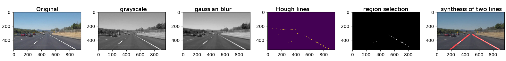

# **Finding Lane Lines on the Road** 

**Finding Lane Lines on the Road**

The goals / steps of this project are the following:
* Make a pipeline that finds lane lines on the road
* Reflect on your work in a written report


[//]: # (Image References)

[image1]: ./examples/grayscale.jpg "Grayscale"

---

### Reflection

### 1. Describe your pipeline. As part of the description, explain how you modified the draw_lines() function.



This simple pipeline consisted of 5 steps, as shown in the above figure. First, the image is converted to grayscale. Second, the image is smoothed by a gaussian blur operation. Third, the image is processed by Hough line transformation to derive all possible line segments. Fourth, the image is masked to only select a region corresponding to the front lane the car is facing. Finally, all line segments in the selection region is processed by function to derive two lane lines, one for the left the other for the right.

To draw a single line on the left and right lanes, a new helper function is created: 
```python
import math
import collections

# representation of a line segment
LineSeg = collections.namedtuple('LineSeg', ['slope', 'intercept', 'y_bottom', 'y_top'])

# representation of left and right lanes
Lanes = collections.namedtuple('Lanes', ['left', 'right'])

# deduce two lane lines from all lines derived by Hough transformation
# all lines are weighted according to their height so to reject as much as possible the contribution from horizontal lines.
def get_lane_lines(lines):
    left_lines = []
    left_lines_weights = []
    right_lines = []
    right_lines_weights = []
    y_top = 540 # determines the top end of lane lines
    y_bottom = 540 # determines the bottom end of lane lines
    
    for line in lines:
        x1, y1, x2, y2 = line[0][0], line[0][1], line[0][2], line[0][3]

        if min(y1,y2) < y_top:
            y_top = min(y1,y2)
        if max(y1,y2) > y_bottom:
            y_bottom = max(y1,y2)
        
        if x1 == x2:
            slope = 1000 # a large number representing a vertical line
        else:
            slope = (y2-y1)/(x2-x1)
            
        intercept = y2 - slope*x2
        
        if slope < 0: # a potential left lane
            left_lines.append([slope,intercept])
            left_lines_weights.append(y1-y2) # y1 > y2. use vertical height as weights to reject horizontal lines
        if slope > 0: # potential right lane
            right_lines.append([slope,intercept])
            right_lines_weights.append(y1-y2) 
        
    avg_left_line = np.average(left_lines,axis=0, weights=left_lines_weights)    
    avg_right_line = np.average(right_lines,axis=0, weights=right_lines_weights)
    
    return Lanes(LineSeg(*avg_left_line, y_bottom, y_top), LineSeg(*avg_right_line, y_bottom, y_top))
```
* Using the `namedtuple` datastructure is to allow the `.` operation to access data members of a Lanes object, e.g. we can now do this:
```python
left_lane_slope = lanes.left.slope
```

* the following segment is to deduce where the lane lines should start and end, i.e. the length of the lane lines:
```python
if min(y1,y2) < y_top:
  y_top = min(y1,y2)
if max(y1,y2) > y_bottom:
  y_bottom = max(y1,y2)
```

* this function outputs only two lines representing the left and right lanes. The final two lines are average of all lines determined by the Hough lines operation. All line candidates are divided into two groups according to their slope values. The averaging weights are the corresponding height of each line segments, such that horizontal lines contributes less to the final average lines.

### 2. Identify potential shortcomings with your current pipeline


One potential shortcoming would be what would happen when ... 

Another shortcoming could be ...


### 3. Suggest possible improvements to your pipeline

A possible improvement would be to ...

Another potential improvement could be to ...
